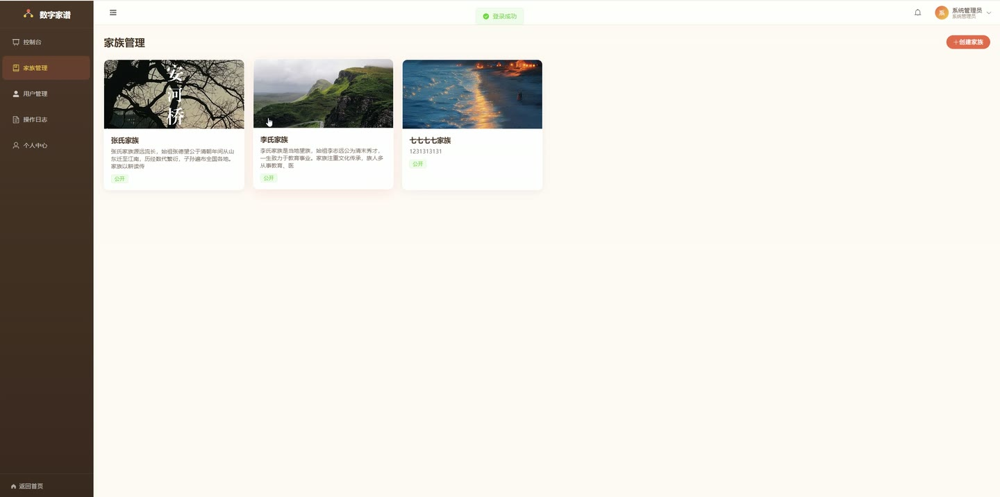
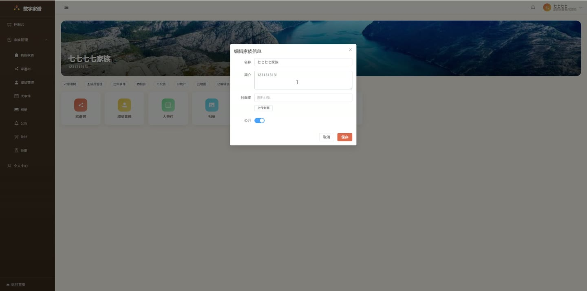
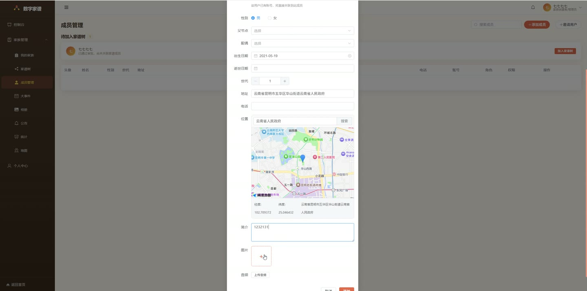
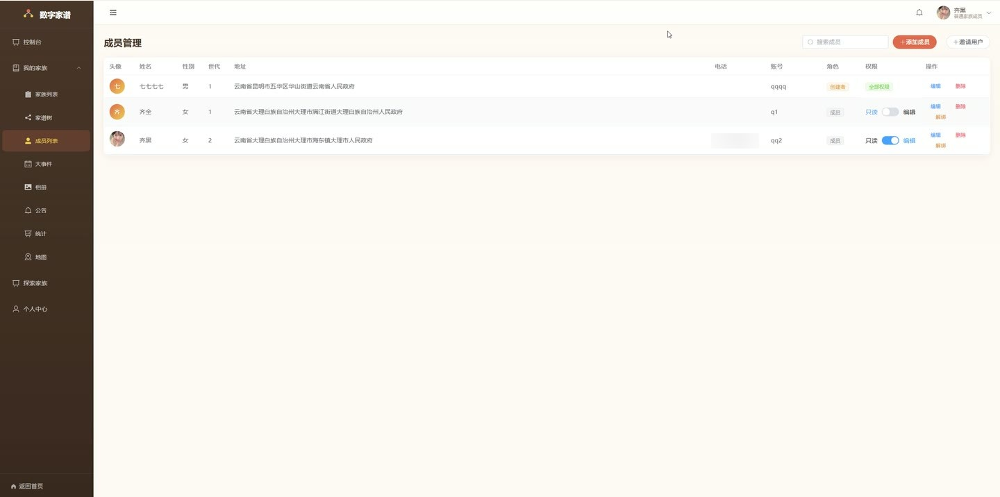

# (附文档)Springboot3+Vue3+MySQL 交互式数字家谱设计与可视化系统

**技术栈**：Springboot3、Vue3、MySQL

### 系统简介

交互式数字家谱设计与可视化系统采用 Spring Boot 3 + Vue 3 前后端分离架构，支持家族创建、成员管理、家谱树可视化、家族相册、大事件记录、公告发布、地理信息标注、数据统计与权限控制。系统内置管理员、创建者、普通成员三种角色，并提供公开家谱浏览与申请加入机制。
 
### 核心功能
 
### 普通用户端

 
- 注册账号并选择角色（创建者/成员），登录后获取 JWT Token 自动跳转控制台 
- 查看个人资料并修改昵称、头像、手机、邮箱、性别、地址及经纬度信息 
- 修改登录密码，需验证原密码后设置新密码（BCrypt 加密存储） 
- 浏览公开家族列表，查看公开家族详情及其成员家谱树（无需登录） 
- 申请加入指定家族，等待创建者审核通过后成为正式成员 
- 查看收到的家族邀请列表，选择接受或拒绝邀请 
- 查看个人消息列表（申请结果、邀请通知、系统消息），标记单条或全部已读 
- 在控制台查看未读消息数量角标，点击铃铛图标进入消息中心 
- 探索家族页面列出所有公开家族，支持点击查看详情与申请加入
 
### 管理员端

 
- 查看系统概览统计：总用户数、总家族数、总成员数 
- 管理所有用户：分页列表、按用户名/昵称搜索、启用/禁用账号、修改角色（管理员/创建者/成员） 
- 管理所有家族：分页列表、按名称搜索、查看详情、编辑信息、删除家族 
- 查看全站操作日志：分页展示操作记录，支持按家族筛选，显示操作人昵称与家族名称 
- 访问任何家族的树形视图、成员管理、事件、相册、公告、统计、地图页面（拥有最高权限）
 
### 创建者端

 
- 创建新家族：填写名称、描述、封面图片、是否公开，创建后自动成为创建者 
- 编辑家族信息：修改名称、描述、封面图片、公开状态 
- 管理成员：查看家族成员列表（含用户名、昵称、角色、权限、状态），审核待加入申请（通过/拒绝） 
- 邀请用户加入家族：搜索可用用户（MEMBER 角色且未在家族中），发送邀请通知 
- 设置成员权限：将成员权限设为 VIEW（仅查看）或 EDIT（可编辑），创建者默认可编辑 
- 移除家族成员：删除成员与家族的关联记录 
- 添加家族成员节点：填写姓名、性别、出生/逝世日期、头像、生平、电话、地址、父节点、配偶、世代、经纬度；可关联已有用户或自动创建账号（默认密码 123456） 
- 编辑/删除成员节点：修改成员信息或从家族中移除 
- 按关键词搜索成员：支持按姓名、地址、生平模糊搜索 
- 管理家族大事件：添加事件（标题、内容、日期、关联成员 ID）、编辑、删除，按日期倒序排列 
- 管理家族相册：上传图片（支持 50MB 以内文件）、添加标题与描述、删除照片，按上传时间倒序 
- 管理家族公告：发布公告（标题、内容）、编辑、删除，按发布时间倒序 
- 查看家族统计：总成员数、男女比例、世代数、各世代人数分布、长寿成员排行（年龄≥70 岁） 
- 查看家族地图：成员地址地理坐标标注（基于 longitude/latitude 字段） 
- 查看操作日志：记录创建家族、更新信息、添加/修改/删除成员等操作
 
### 成员端

 
- 查看已加入的家族列表，点击进入家族详情页 
- 浏览家族家谱树可视化页面（基于成员父子关系与配偶关系渲染） 
- 查看家族成员列表，浏览每个成员的详细信息 
- 查看家族大事件时间线，按日期排序展示 
- 浏览家族相册，查看照片及描述 
- 查看家族公告列表 
- 查看家族统计数据（人数、性别、世代分布、长寿排行） 
- 查看家族成员地理地图标注 
- 探索公开家族，申请加入其他家族
 
### 技术栈

 后端框架Spring Boot 3.x ORMMyBatis-Plus（自动映射、分页插件） 权限认证JWT（Token 鉴权）+ BCrypt 密码加密 前端框架Vue 3（Composition API + Script Setup） 状态管理Pinia（用户状态、未读消息数） UI 组件库Element Plus（菜单、表格、表单、对话框、上传等） 路由Vue Router 4（Hash 模式 + 导航守卫） 数据库MySQL（含初始化 SQL 脚本） 构建工具Vite（前端构建）
 
### 交付内容

 
- 后端完整源码 
- 前端完整源码 
- 数据库初始化脚本 
- 万字文档

## 界面展示

---

## 获取完整源码 + 万字文档

本仓库为项目介绍页。**完整前后端源码、数据库初始化脚本、万字项目文档**，请加微信 `kangkangcode`，或访问 [codekk.top](http://codekk.top) 获取。

可作课程设计 / 毕业设计参考，支持远程部署调试。